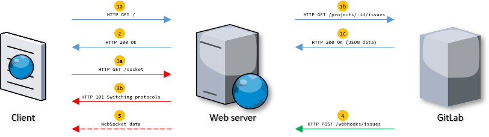

# Realtime Web Application

Simple server application that uses socket.io, webhooks and gitlab API.

## The web application

The image above describes the web application's architecture.

### Key points.
1. When a client connects to the application, it will use the GitLab API to fetch project issues.
2. When your application has retrieved the issues from your repository, the application renders the issues into HTML.
3. One thing the client script needs to do is, for example, to connect to your server's WebSocket channel. (#13)
3. The gitlab repo fires a webhook to the application to handle, when a issue event occurs.
4. The application uses the websocket server to transmit the received and transformed payload in realtime.
5. From the application, a user can close and open an issue.
6. From the gitlab repo; closing, opening, updating and creating issues can be done.